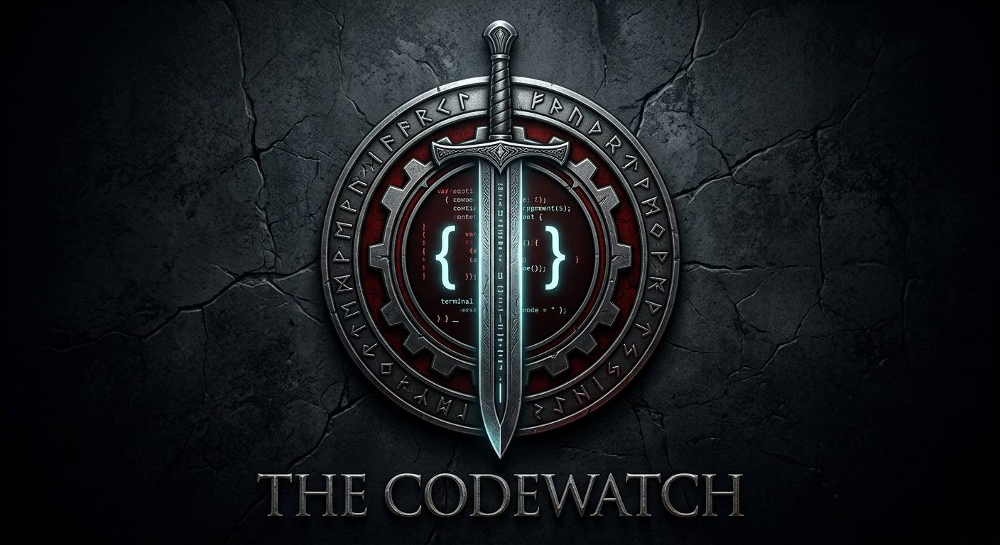

# Code Watch

  

# 👨‍💻 Code Watch

### Building Modern Web Experiences

**Full-Stack Web Development Team**

[About Us](#-about-us) •
[Services](#-services) •
[Tech Stack](#-tech-stack) •
[Workflow](#-workflow) •
[Contact](#-contact)

---

### 🇺🇸 English | 🇮🇷 فارسی

---

# 🇺🇸 English

## 🚀 About Code Watch

Code Watch is a multidisciplinary web development team focused on building modern, scalable, secure, and high-performance web solutions.

Our team combines specialists from different fields of digital production, including:

- Front-End Development
- Back-End Development
- UI/UX Design
- Graphic Design
- Web Architecture
- Database Design
- Performance Optimization
- Technical Consulting

Our mission is simple:

> Create digital products that are beautiful, functional, maintainable, and built for long-term success.

We believe that successful web projects require more than just writing code. They require strategy, design thinking, user experience, performance engineering, and continuous improvement.

As our team grows, new disciplines and specialties may be integrated into the organization to expand our capabilities and provide even more complete solutions.

---

## 🎯 Vision

To become a trusted web development organization capable of delivering professional digital products that meet modern industry standards.

---

## 🏆 Our Goals

- Develop high-quality web applications
- Build scalable software architectures
- Deliver exceptional user experiences
- Follow modern development standards
- Encourage teamwork and knowledge sharing
- Continuously learn and adopt new technologies

---

## 🛠 Services

### Front-End Development

Building responsive and interactive user interfaces using modern technologies and best practices.

### Back-End Development

Creating robust server-side systems, APIs, authentication systems, and business logic.

### UI/UX Design

Designing user-centered experiences that balance aesthetics and usability.

### Graphic Design

Creating visual identities, digital assets, and graphical components that strengthen products.

### Website Development

Designing and developing complete websites from concept to deployment.

### Web Application Development

Building custom platforms, dashboards, management systems, and business applications.

---

## ⚙️ Tech Stack

### Front-End

- HTML5
- CSS3
- JavaScript
- TypeScript
- React
- Next.js

### Back-End

- Node.js
- PHP
- Express.js
- REST API

### Database

- MySQL
- PostgreSQL
- MongoDB

### Design

- Figma
- Adobe Photoshop
- Adobe Illustrator

### Tools

- Git
- GitHub
- VS Code
- Docker

---

## 📋 Development Workflow

### 1. Planning

Understanding project requirements and defining objectives.

### 2. Design

Creating wireframes, UI systems, and visual assets.

### 3. Development

Building scalable and maintainable solutions.

### 4. Testing

Ensuring quality, security, and performance.

### 5. Deployment

Launching stable production-ready products.

### 6. Maintenance

Providing updates, improvements, and support.

---

## 💡 Core Principles

- Clean Code
- Security First
- Performance Matters
- User-Centered Design
- Continuous Learning
- Team Collaboration
- Long-Term Maintainability

---

## 🤝 Collaboration

We welcome collaboration opportunities, open-source contributions, and professional partnerships.

If you share our passion for building exceptional web experiences, we'd be happy to connect.

---

# 🇮🇷 فارسی

## 🚀 درباره Code Watch

Code Watch یک تیم توسعه وب چندتخصصی است که با هدف طراحی و توسعه راهکارهای مدرن، مقیاس‌پذیر، امن و پرسرعت فعالیت می‌کند.

اعضای تیم ما از حوزه‌های مختلف تولید محصولات دیجیتال تشکیل شده‌اند، از جمله:

- توسعه فرانت‌اند
- توسعه بک‌اند
- طراحی رابط و تجربه کاربری
- طراحی گرافیک
- معماری نرم‌افزار
- طراحی پایگاه داده
- بهینه‌سازی عملکرد
- مشاوره فنی

هدف ما تنها نوشتن کد نیست.

ما باور داریم که یک محصول موفق ترکیبی از طراحی مناسب، تجربه کاربری حرفه‌ای، معماری اصولی، امنیت، عملکرد بالا و نگهداری بلندمدت است.

با رشد تیم، بخش‌ها و تخصص‌های جدید نیز می‌توانند به مجموعه اضافه شوند تا توانایی‌های ما گسترده‌تر شده و خدمات کامل‌تری ارائه دهیم.

---

## 🎯 چشم‌انداز

تبدیل شدن به یک مجموعه حرفه‌ای و قابل اعتماد در حوزه توسعه وب که بتواند محصولات دیجیتال باکیفیت و مطابق با استانداردهای روز صنعت تولید کند.

---

## 🏆 اهداف ما

- توسعه نرم‌افزارهای وب باکیفیت
- ایجاد معماری‌های پایدار و مقیاس‌پذیر
- ارائه تجربه کاربری حرفه‌ای
- رعایت استانداردهای مدرن توسعه نرم‌افزار
- ترویج همکاری تیمی و انتقال دانش
- یادگیری مداوم فناوری‌های جدید

---

## 🛠 خدمات

### توسعه فرانت‌اند

پیاده‌سازی رابط‌های کاربری واکنش‌گرا، سریع و مدرن.

### توسعه بک‌اند

طراحی و توسعه سیستم‌های سمت سرور، APIها، احراز هویت و منطق کسب‌وکار.

### طراحی رابط و تجربه کاربری

طراحی تجربه‌هایی که هم زیبا باشند و هم استفاده از آن‌ها ساده و لذت‌بخش باشد.

### طراحی گرافیک

خلق هویت بصری، عناصر گرافیکی و دارایی‌های دیجیتال.

### طراحی و توسعه وب‌سایت

پیاده‌سازی وب‌سایت‌های کامل از مرحله ایده تا انتشار.

### توسعه وب اپلیکیشن

ساخت پنل‌های مدیریتی، سامانه‌های اختصاصی و پلتفرم‌های تحت وب.

---

## ⚙️ فناوری‌ها

### فرانت‌اند

- HTML5
- CSS3
- JavaScript
- TypeScript
- React
- Next.js

### بک‌اند

- Node.js
- PHP
- Express.js
- REST API

### پایگاه داده

- MySQL
- PostgreSQL
- MongoDB

### طراحی

- Figma
- Photoshop
- Illustrator

### ابزارها

- Git
- GitHub
- VS Code
- Docker

---

## 📋 فرآیند توسعه

### ۱. برنامه‌ریزی

بررسی نیازمندی‌ها و تعیین اهداف پروژه.

### ۲. طراحی

طراحی ساختار، رابط کاربری و عناصر بصری.

### ۳. توسعه

پیاده‌سازی راهکارهای اصولی و قابل نگهداری.

### ۴. تست

بررسی کیفیت، امنیت و عملکرد محصول.

### ۵. استقرار

انتشار نسخه پایدار و آماده استفاده.

### ۶. پشتیبانی و توسعه

بهبود مستمر، رفع مشکلات و افزودن قابلیت‌های جدید.

---

## 💡 ارزش‌های اصلی

- کدنویسی تمیز
- امنیت
- عملکرد بالا
- تمرکز بر کاربر
- یادگیری مداوم
- همکاری تیمی
- نگهداری بلندمدت

---

## 🤝 همکاری

ما از همکاری‌های حرفه‌ای، پروژه‌های مشترک و مشارکت در توسعه نرم‌افزار استقبال می‌کنیم.

اگر شما نیز به ساخت محصولات وب حرفه‌ای علاقه‌مند هستید، خوشحال می‌شویم با شما همکاری کنیم.

---

### Code Watch

**Building The Future Of The Web**

